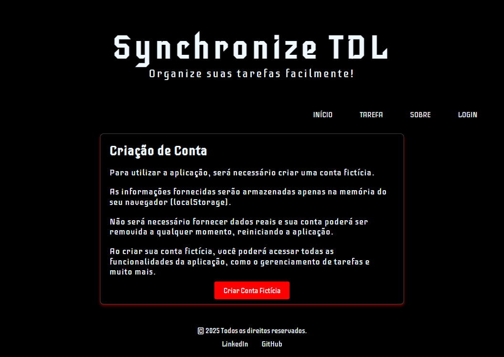

# 📝 ToDo List - Synchronize TDL

## 💻 Descrição do projeto

Este projeto visa criar uma Aplicação de Gestão de Tarefas utilizando o framework Angular, com foco em melhorar a experiência do usuário através de uma interface dinâmica e reativa. 

A aplicação permite que o usuário crie, edite, organize e exclua tarefas, tudo de forma intuitiva e eficiente. Além disso, ela oferece funcionalidades de persistência de dados usando LocalStorage, o que garante que as tarefas sejam salvas e recuperadas entre as sessões.

    
 👀 Prévia 

    

> **Colaboração:** Not found  
> **Status:** Em Desenvolvimento ❌

## 📜 Índice

- [Descrição](#-descrição-do-projeto)
- [Conceitos Aprendidos](#-conceitos-aprendidos)
- [Tecnologias Utilizadas](#--tecnologias-utilizadas)
- [Instalação](#-instalação)
- [Uso](#-uso)
- [Funcionalidades](#-funcionalidades)
- [Pendências](#-pendências)
- [Contribuição](#-contribuição)
- [Informações Adicionais](#-informações-adicionais)
- [Licença](#-licença)
- [Conclusão](#-conclusão)

## ✅ Conceitos Aprendidos 

Pendente preenchimento.

## 🛠 Tecnologias Utilizadas

## ⚙ Instalação

Pendente preenchimento.

## 🚀 Uso 

Pendente preenchimento.

## 🧩 Funcionalidades

### **1️⃣ CRUD de Tarefas**  
[❌] Criar tarefas com título, descrição e data de vencimento  
[❌] Editar tarefas existentes  
[❌] Marcar tarefas como concluídas  
[❌] Excluir tarefas  

### **2️⃣ Persistência de Dados**  
[❌] Armazenar tarefas no **LocalStorage** para manter os dados entre sessões  
[❌] Atualizar o LocalStorage sempre que houver mudanças  

### **3️⃣ Filtros e Ordenação**  
[❌] Filtrar tarefas por status (pendente, concluída)  
[❌] Filtrar tarefas por data de vencimento  

### **4️⃣ UI/UX Melhorada**  
[❌] Animações e transições usando **Angular Animations**  
[❌] Notificações visuais para sucesso ou erro nas operações  

### **5️⃣ Reatividade e Melhor Desempenho**  
[❌] Utilizar **RxJS** para atualizar a lista de tarefas em tempo real  
[❌] Implementar **Subject/BehaviorSubject** para comunicação entre componentes  
[❌] Criar **Observables** para manipulação eficiente de dados  

### **6️⃣ Melhoria da Experiência do Usuário**  
[❌] Confirmação antes de excluir uma tarefa  
[❌] Exibir contadores (quantas tarefas pendentes/concluídas)  
[❌] Opção de "desfazer" exclusões recentes  

### **7️⃣ Responsividade e Estilização**  
[❌] Layout responsivo para mobile e desktop  
[❌] Uso de Material Design ou Bootstrap para um visual moderno  

## ⏳ Pendências

Pendente preenchimento.

## 🤝 Contribuição

Pendente preenchimento.

## 💡 Informações adicionais

Pendente preenchimento.

## 🔓 Licença

Este projeto está licenciado sob a Licença MIT.

## 🏁 CONCLUSÃO

Pendente preenchimento.
